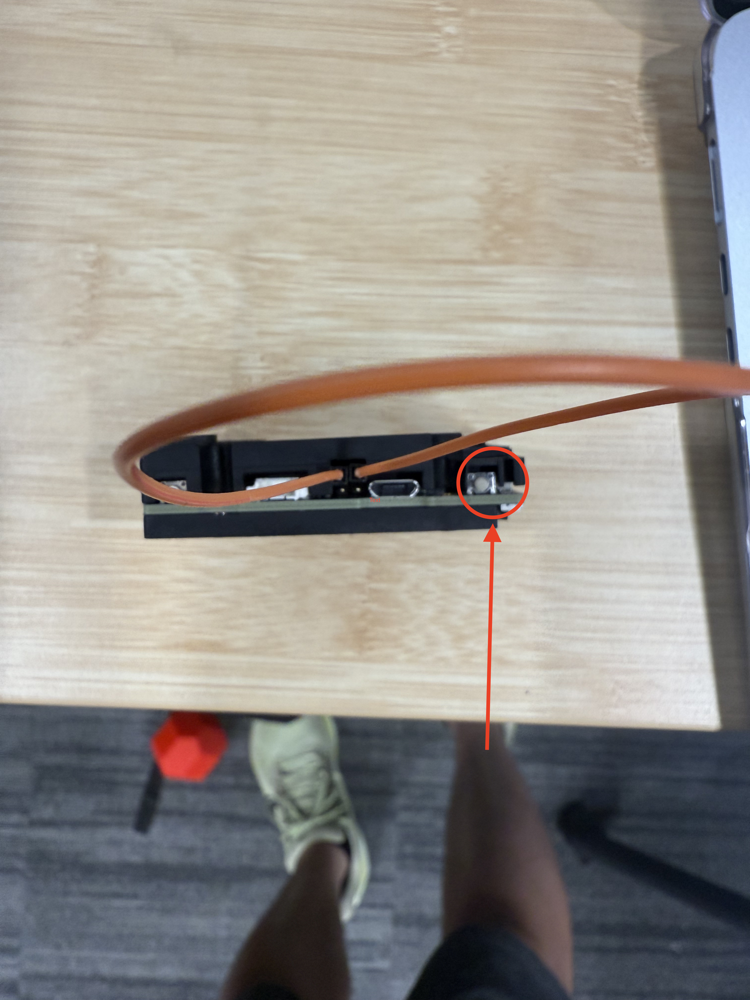
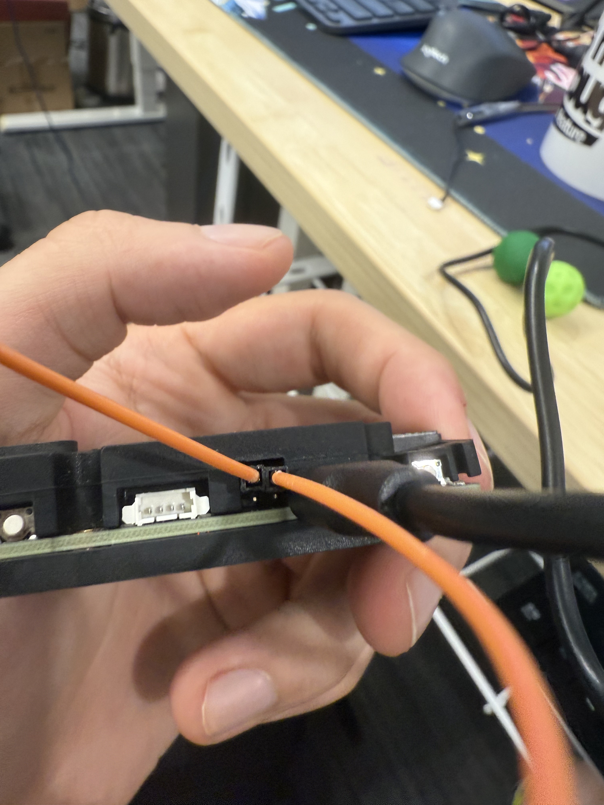
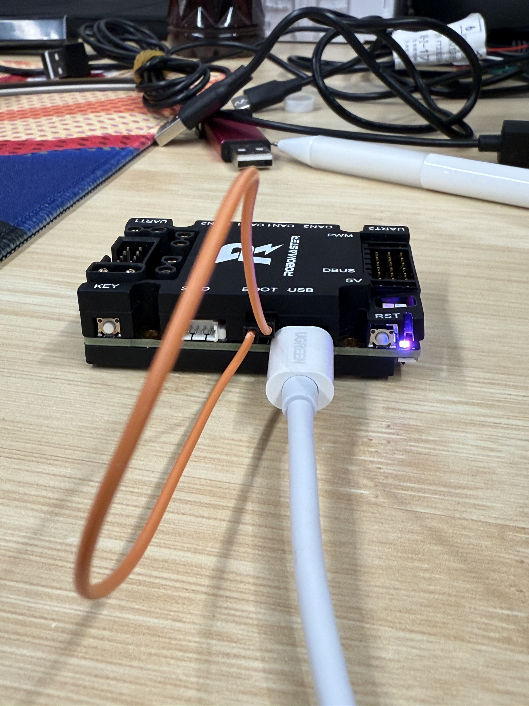
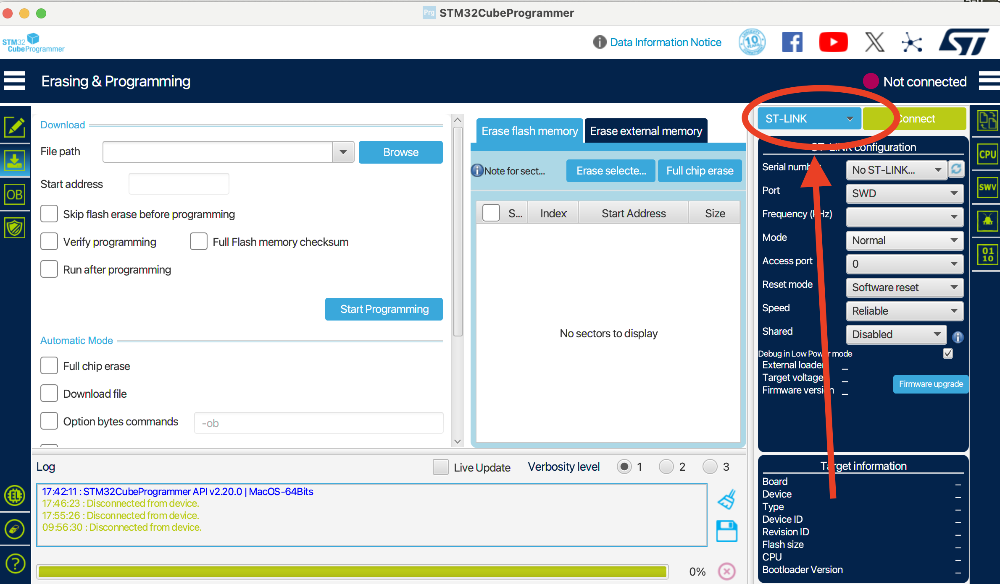
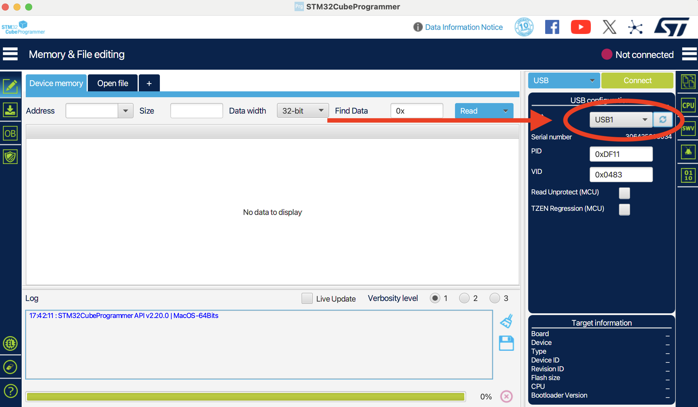
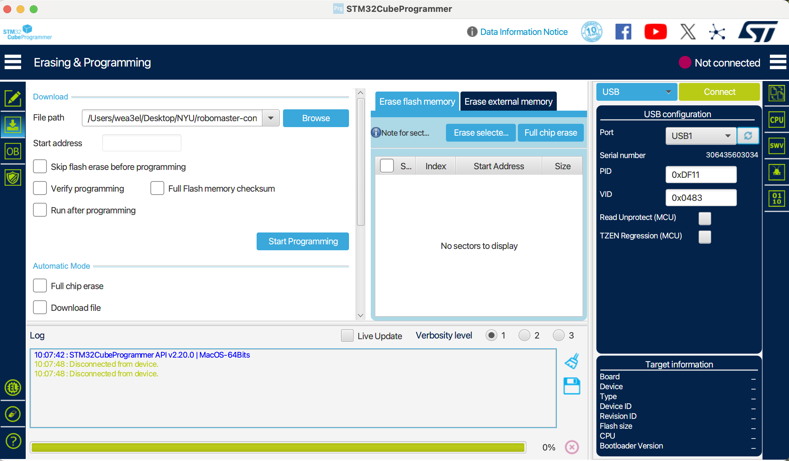
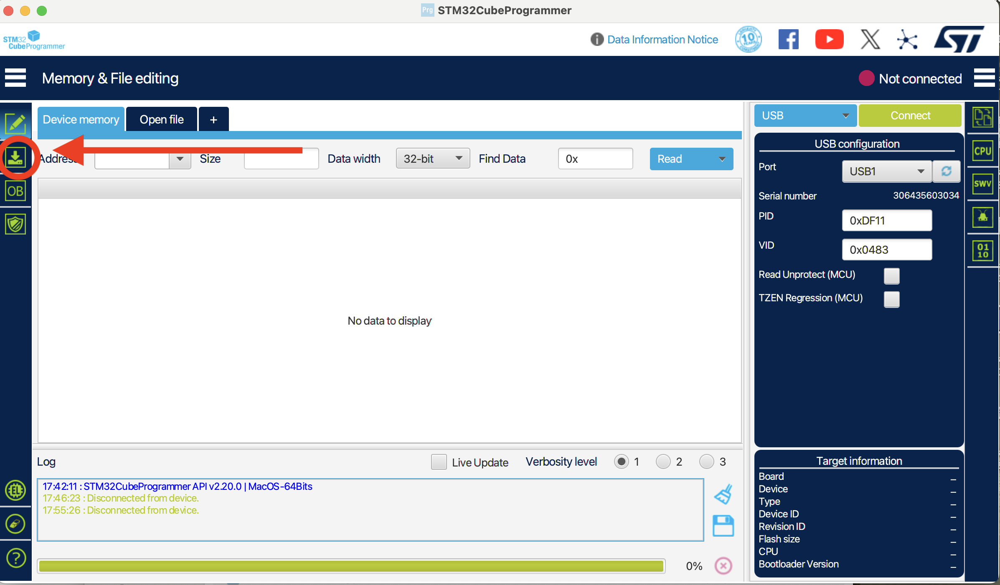
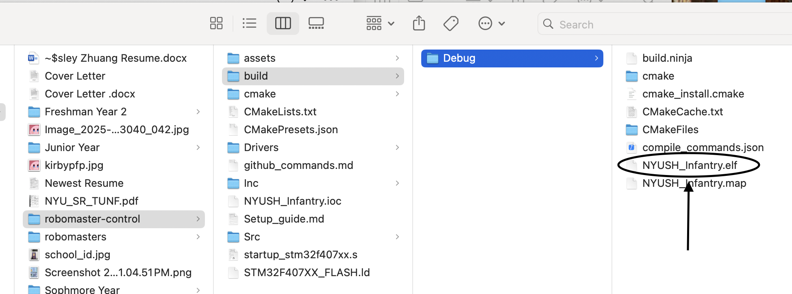
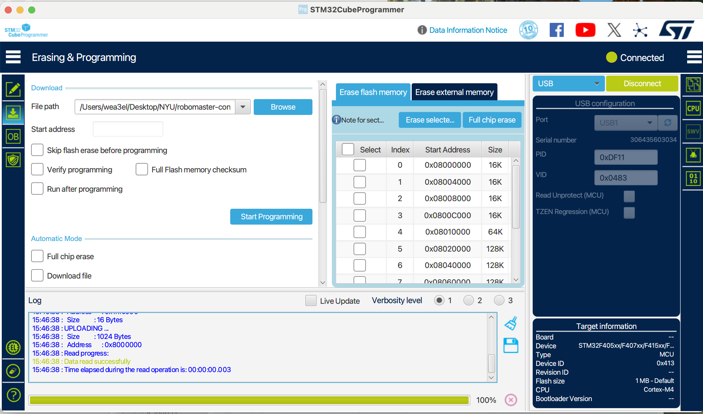

# Flashing Firmware to C Board

This guide explains how to flash compiled firmware onto the RoboMaster Development Board Type C.

## Prerequisites

- RoboMaster Development Board Type C
- USB cable (Type-C or MicroUSB depending on your board)
- Compiled firmware (`.elf`, `.hex`, or `.bin` file in `build/` directory)
- One of the following tools:
  - **STM32CubeProgrammer** (GUI method, recommended for beginners)
  - **dfu-util** (Command line, cross-platform)
  - **OpenOCD** (For ST-Link/DAP-Link debuggers)

---

## Method 1: STM32CubeProgrammer (GUI)

### Step 1: Enter DFU Boot Mode

1. **Connect** the C Board to your computer via USB
2. **Locate** the BOOT0 pins (usually near the top of the board)
3. Use a jumper wire to **short the top two BOOT0 pins**


<p align="center"><sub><strong>Figure 1</strong>: BOOT0 pins location and jumper wire placement</sub></p>


<p align="center"><sub><strong>Figure 2</strong>: Close-up of BOOT0 pins shorted with jumper wire</sub></p>

4. Press the **RST (reset) button** on the board


<p align="center"><sub><strong>Figure 3</strong>: RST button location on C Board</sub></p>

5. Remove the jumper wire from BOOT0

The board is now in DFU (Device Firmware Upgrade) mode.

### Step 2: Connect with STM32CubeProgrammer

1. Open **STM32CubeProgrammer**
2. At the top right, change connection type from **ST-Link** to **USB**


<p align="center"><sub><strong>Figure 4</strong>: Change connection type to USB</sub></p>

3. Click the **refresh button** next to the port dropdown
4. You should see **USB1** appear in the dropdown


<p align="center"><sub><strong>Figure 5</strong>: USB1 appears in port dropdown</sub></p>

5. Click **Connect** (top right) - the status should turn green


<p align="center"><sub><strong>Figure 6</strong>: Click Connect button (status turns green)</sub></p>

### Step 3: Flash Firmware

1. Click the **Erasing & programming** tab on the left sidebar


<p align="center"><sub><strong>Figure 7</strong>: Switch to Erasing & programming tab</sub></p>

2. Click **Browse** and navigate to your firmware file:
   - For basic_framework: `build/basic_framework.elf` or `build/basic_framework.hex`


<p align="center"><sub><strong>Figure 8</strong>: Browse and select your .elf or .hex file</sub></p>

3. Click **Start Programming**


<p align="center"><sub><strong>Figure 9</strong>: Click Start Programming button</sub></p>

4. Wait for the progress bar to complete
5. Click **Disconnect**

### Step 4: Exit DFU Mode

Press the **RST button** once more. Your firmware is now running!

---

## Method 2: DFU-Util (Command Line)

DFU-util is a cross-platform command-line tool for flashing firmware via USB.

### Installation

**macOS:**
```bash
brew install dfu-util
```

**Windows (MSYS2/MinGW64):**
```bash
pacman -S mingw-w64-x86_64-dfu-util
```

**Linux:**
```bash
sudo apt install dfu-util  # Debian/Ubuntu
sudo dnf install dfu-util  # Fedora
```

### Flashing Steps

1. **Enter DFU mode** (same as Method 1, Step 1)

2. **Verify connection:**
   ```bash
   dfu-util -l
   ```
   You should see output like:
   ```
   Found DFU: [0483:df11] ver=2200, devnum=X, cfg=1, intf=0, ...
   ```

3. **Flash firmware:**
   ```bash
   # Using Makefile target (recommended)
   make flash_dfu

   # Or manually
   dfu-util -a 0 -s 0x08000000:leave -D build/basic_framework.bin
   ```

4. **Exit DFU mode:** The firmware will auto-start, or press RST

### Expected Output

```
dfu-util 0.11
Opening DFU capable USB device...
Device ID 0483:df11
...
Downloading to address = 0x08000000
Download        [=========================] 100%
File downloaded successfully
```

---

## Method 3: OpenOCD (With ST-Link/DAP-Link)

If you have an external debugger (ST-Link V2/V3 or DAP-Link), you can use OpenOCD.

### Installation

**macOS:**
```bash
brew install openocd
```

**Windows (MSYS2/MinGW64):**
```bash
pacman -S mingw-w64-x86_64-openocd
```

**Linux:**
```bash
sudo apt install openocd  # Debian/Ubuntu
```

### Flashing Steps

1. **Connect debugger** to the C Board's SWD pins (SWDIO, SWCLK, GND, 3.3V)
2. **Connect debugger** to your computer via USB
3. **Flash firmware:**

   ```bash
   # For DAP-Link
   make flash_dap

   # For ST-Link
   make flash_stlink

   # For J-Link (Windows)
   make flash_jlink
   ```

---

## Troubleshooting

### DFU Device Not Found

**Problem:** `dfu-util -l` shows no devices

**Solutions:**
- Verify you entered DFU mode correctly (BOOT0 jumper + RST)
- Try a different USB cable
- Try a different USB port (avoid hubs)
- **Windows:** Install DFU drivers using [Zadig](https://zadig.akeo.ie/):
  1. Download and run Zadig
  2. Select "STM32 BOOTLOADER" device
  3. Select "WinUSB" driver
  4. Click "Replace Driver"
- **Linux:** Add udev rules (see [setup-guide.md](setup-guide.md#step-4-set-usb-permissions-for-dfu))

### STM32CubeProgrammer Can't Connect

**Problem:** Connection stays red/disconnected

**Solutions:**
- Ensure board is in DFU mode
- Select correct connection type (USB, not ST-Link)
- Click refresh button
- Try unplugging and replugging USB
- Restart STM32CubeProgrammer

### "File Format Not Supported"

**Problem:** STM32CubeProgrammer rejects your file

**Solutions:**
- Use `.elf` or `.hex` file (not `.bin` for CubeProgrammer)
- For `.bin` files, use dfu-util instead
- Verify file was generated successfully: `ls -lh build/`

### Board Not Responding After Flash

**Problem:** Code doesn't run after flashing

**Solutions:**
- Press **RST button** to restart
- Check if BOOT0 jumper is still connected (remove it!)
- Verify firmware was built for the correct board (STM32F407)
- Check build log for errors: `make clean && make -j12`

---

## Quick Reference

### Makefile Flash Targets

```bash
make flash          # Default (uses dfu-util)
make flash_dfu      # DFU-util (USB)
make flash_dap      # OpenOCD + DAP-Link
make flash_stlink   # OpenOCD + ST-Link
make flash_jlink    # J-Link (Windows)
```

### DFU Mode Entry

1. Short BOOT0 top two pins
2. Press RST button
3. Remove BOOT0 jumper

### Exit DFU Mode

Press RST button (or power cycle)

---

## See Also

- [setup-guide.md](setup-guide.md) - Development environment setup
- [Makefile](../Makefile) - Build system documentation (see "help" target)
- STM32CubeProgrammer: https://www.st.com/en/development-tools/stm32cubeprog.html
